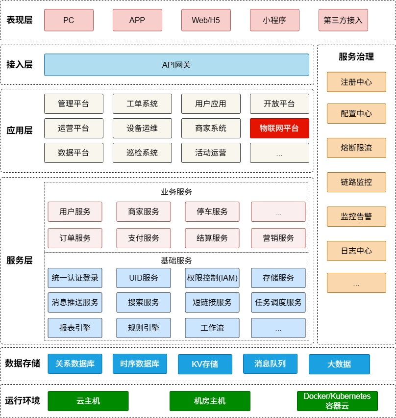
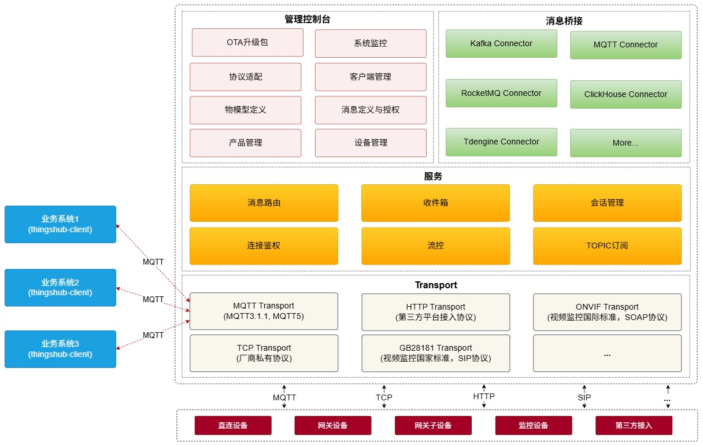

# Thingshub 物联网平台

## 1、系统简介
Thingshub基于Java 17、reactor-netty和Ignite进行开发，是一个比较完整的企业级物联网平台，能帮助企业快速将设备接入平台，并向上游业务系统提供标准化接口与设备进行互操作。

Thingshub支持多种标准协议，通过脚本可对私有协议进行转换，理论上可支持任何私有协议设备的接入。

## 2、系统架构

#### 2.1、整体架构
物联网平台是企业技术平台不可或缺的组成部分，作为设备接入技术底座，上游对接各类业务系统，下游连接各种设备。它在整体个企业技术平台中的具体位置如下所示：

	
Thingshub的具体架构如下图所示：

## 3、核心特性

#### 3.1、统一接入
支持MQTT、TCP、HTTP、GB28181等协议，通过插件机制可实现企业私有协议。通过协议转换脚本可将不同厂商、不同设备的消息以统一数据格式提供给上游业务系统。
	
#### 3.2、设备管理
在产品类别、产品定义、设备和设备分组、物模型、消息模型、协议适配等维度对设备进行统一管理。
	
#### 3.3、权限控制
对上游业务系统按产品、消息模型等维度进行操作控制，对业务系统用户按产品、设备、消息等维度进行访问控制。
	
#### 3.4、规则引擎
自定义规则配置，实现设备告警、场景联动等功能
	
#### 3.5、数据桥接
可通过连接器将数据路由到现有消息中间件或时序数据库，比如Kafka、MQTT、RocketMQ、ClickHouse、Tdengine等
	
#### 3.6、系统监控

	
#### 3.7、系统集成
通过插件与企业现有平台进行集成，作为平台的一部分
	
## 4、技术栈
[reactor-netty](https://projectreactor.io/)
[Ignite](https://ignite.apache.org/)
[Guice](https://github.com/google/guice)
......
	
## 5、参考资料
[MQTT-3.1.1规范](http://docs.oasis-open.org/mqtt/mqtt/v3.1.1/mqtt-v3.1.1.html)
[MQTT-5.0规范](https://docs.oasis-open.org/mqtt/mqtt/v5.0/mqtt-v5.0.html)
[GB/T 28181-2022规范](http://c.gb688.cn/bzgk/gb/showGb?type=online&hcno=8BBC2475624A6C31DC34A28052B3923D&request_locale=zh)
[BifroMQ](https://bifromq.apache.org/)
