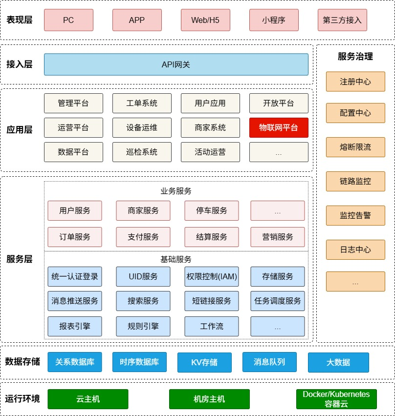
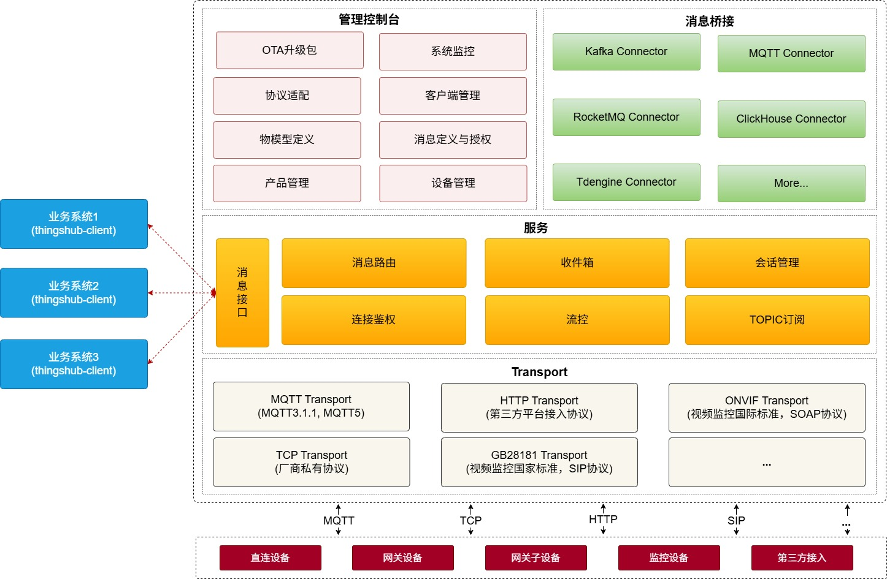

# Thingshub 物联网平台

## 1、简介
Thingshub基于Java 17、reactor-netty和Ignite进行开发，是一个比较完整的企业级物联网平台，能帮助企业将不同厂家、不同协议的设备快速接入平台，并向上游业务系统提供标准化接口与设备进行互操作，设备侧无需改动，特别适合接入那些遗留场景的设备。
Thingshub提供多种标准协议支持，完全自主实现，不依赖第三方消息中间件。


## 2、系统架构

### 2.1、整体架构
物联网平台是物联网企业技术平台不可或缺的组成部分，作为设备管理的技术底座，上游对接各类业务系统，下游连接各种业务场景的设备。它在整个企业技术平台中的具体位置如下图红色部分所示：



### 2.2、Thingshub技术架构
	
Thingshub物联网平台的架构如下图所示：




## 3、核心特性

- **多协议设备接入** — 支持 MQTT v3/v5 (TCP & WebSocket)、自定义 TCP、HTTP、GB28181、ONVIF 协议
- **消息路由与发布** — 基于主题的发布/订阅、通配符订阅、共享订阅、保留消息、遗嘱消息
- **协议适配** — 通过可插拔脚本引擎（JavaScript / GraalVM、Python / Jython），支持自定义消息预处理和后处理
- **设备管理** — 产品目录、设备和设备分组、会话管理、物模型定义与验证、消息定义与权限控制等
- **管理控制台** — 基于 Vue 3 + TinyPro 的 管理前端
- **数据桥接** — 支持将设备上报消息桥接到 Kafka、RocketMQ、TDengine、ClickHouse、外部 MQTT Broker
- **集群与高可用** — 基于 Ignite 实现分布式集群、节点自动发现、故障检测
- **访问控制 (ACL)** — 基于 jCasbin 的 RBAC 权限模型，支持细粒度操作授权
- **OTA升级** — 固件包上传、管理和分发
- **日志管理** — 基于 Lucene 的全文搜索日志，支持按协议分文件记录
- **监控指标** — 基于 Micrometer 的指标收集，支持连接限流、背压控制、消息去重
- **MCP服务器** — 支持模型上下文协议 (Model Context Protocol)，可用于 AI 助手集成
- **规则引擎** — 自定义规则配置，实现设备告警、场景联动等功能
- **系统集成** — 通过插件与企业现有平台进行无缝集成，比如统一认证、微服务调用等


## 4、快速开始

### 4.1、构建安装包

#### 4.1.1、前提条件

* JDK 17+
* Maven 3.8.0+

#### 4.1.2、获取源码

克隆仓库到本地工作空间:

```
cd <YOUR_WORKSPACE>
git clone https://github.com/thingshub-io/thingshub thingshub
```

#### 4.1.3、编译打包

首先，配置maven toolchains：
```
... 
<toolchain>
  <type>jdk</type>
  <provides>
    <version>17</version>
    <vendor>graalvm</vendor>
  </provides>
  <configuration>
    <jdkHome>D:/graalvm-jdk-17</jdkHome>
  </configuration>
</toolchain>
...

```

进入项目根目录，执行以下命令:

```
cd thingshub
mvn clean package
```

安装包位于 `/build/target`：
 
* `thingshub-<VERSION>-linux.tar.gz`
* `thingshub-<VERSION>-windows.zip`

### 4.2、启动运行

解压`thingshub-<VERSION>-standalone.tar.gz`文件，你将看到以下目录结构：

```
%THINGSHUB_HOME%
|- bin
|- doc
|- etc
|- lib
|- log
|- work
```

想要启动或停止Thingshub，可在在bin目录分别执行以下命令：

- **启动Thingshub**，运行：
  ```
  ./startup.sh
  ```

- **停止Thingshub**，运行：
  ```
  ./shutdown.sh
  ```


## 5、项目结构

```
thingshub
├── benchmark -- JMeter 测试脚本
├── build -- 构建输出
├── thingshub-connector -- 连接器
│   ├── thingshub-connector-clickhouse -- clickhouse连接器
│   ├── thingshub-connector-kafka -- Kafka连接器
│   ├── thingshub-connector-mqtt -- MQTT Broker连接器
│   ├── thingshub-connector-rocketmq -- RocketMQ连接器
│   ├── thingshub-connector-tdengine -- Tdegine连接器
├── thingshub-core -- Thingshub核心模块
├── thingshub-dashboard -- 管理控制台
├── thingshub-mcp --  MCP服务器
├── thingshub-starter -- 启动入口与配置
├── thingshub-transport -- 传输协议
│   ├── thingshub-transport-gb28181 -- GB28181 视频监控协议
│   ├── thingshub-transport-http -- HTTP 协议
│   ├── thingshub-transport-mqtt -- MQTT (TCP + WebSocket) 协议
│   ├── thingshub-transport-onvif -- ONVIF 视频设备协议
│   ├── thingshub-transport-tcp -- 自定义 TCP 协议
```

	
## 6、技术栈
- [reactor-netty](https://projectreactor.io/)
- [Ignite](https://ignite.apache.org/)
- [Guice](https://github.com/google/guice)
- [TinyPro of Vue](https://opentiny.design/vue-pro/docs/start)
- ......

	
## 7、参考资料
- [MQTT-3.1.1规范](http://docs.oasis-open.org/mqtt/mqtt/v3.1.1/mqtt-v3.1.1.html)
- [MQTT-5.0规范](https://docs.oasis-open.org/mqtt/mqtt/v5.0/mqtt-v5.0.html)
- [GB/T 28181-2022规范](http://c.gb688.cn/bzgk/gb/showGb?type=online&hcno=8BBC2475624A6C31DC34A28052B3923D&request_locale=zh)
- [BifroMQ](https://bifromq.apache.org/)


## 8、联系方式
vx: albert394005
